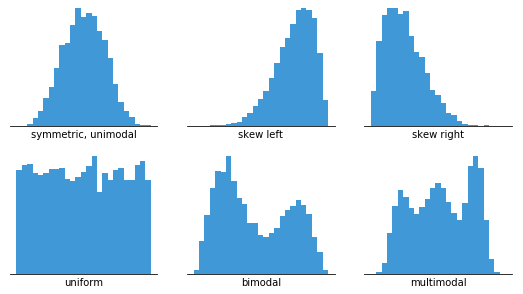

## Class Check Round 1

\Huge [https://pollev.com/sta](https://pollev.com/sta) (6 questions)


## Loading Data: Review

```{r, eval=TRUE, include=TRUE, echo=FALSE, message=FALSE, warning=FALSE}
# regarding `library()`: you don't have to `library(knitr)` if you `knitr::`
knitr::opts_chunk$set(eval=FALSE, include=FALSE, echo=FALSE, message=FALSE, warning=FALSE)

# knitting will default to pdf (rather than, e.g., html)
knitr::opts_chunk$set(dev='pdf')

# Defines a new code chunk `parameter=argument` option which will allow the
# size of printed code+output to be controlled using latex text size names:
# https://www.overleaf.com/learn/latex/Font_sizes%2C_families%2C_and_styles#Reference_guide
def.chunk.hook  <- knitr::knit_hooks$get("chunk")
knitr::knit_hooks$set(chunk = function(x, options) {
  x <- def.chunk.hook(x, options)
  ifelse(options$size != "normalsize", paste0("\n \\", options$size,"\n\n", x, "\n\n \\normalsize"), x)
})

color_block = function(color) {
  function(x, options) sprintf('\\color{%s}\\begin{verbatim}%s\\end{verbatim}',
                               color, x)
}
knitr::knit_hooks$set(message = color_block('red'))
```

```{r, eval=TRUE, include=TRUE, echo=TRUE}
#install.packages("tidyverse")          <- not required since this is
library(tidyverse)                    # <- preinstalled on jupyterhub
```

<!-- The same code is used twice to make code and output text sizes different -->
<!-- First code chunk prints the code and comments, but the code isn't run -->
<!-- Second code chunk is where the code runs with small output message text -->
```{r, eval=FALSE, include=TRUE, echo=TRUE}
# http://database.coffeeinstitute.org/
# https://github.com/rfordatascience/tidytuesday/blob/master/
#                    data/2020/2020-07-07
coffee_ratings <- read_csv("coffee_ratings.csv")  
# the printout below is normal even though RStudio colors it red 
```
```{r, eval=TRUE, include=TRUE, echo=FALSE, message=TRUE, warning=FALSE, size="footnotesize", color="red"}
coffee_ratings <- read_csv("coffee_ratings.csv") 
```

## Viewing Data: Review

<!-- The same code is used twice to make code and output text sizes different -->
```{r, eval=FALSE, include=TRUE, echo=TRUE}
coffee_ratings %>% glimpse() # useful printout isn't actually a tibble
```
```{r, eval=TRUE, include=TRUE, echo=FALSE, message=TRUE, warning=FALSE, size="footnotesize"}
coffee_ratings %>% glimpse()
```

## RStudio + knitter: An aside

\vspace{.25cm}

```{r, eval=FALSE, include=TRUE, echo=TRUE}
coffee_ratings # %>% head() # %>% knitr::kable()
```

<!-- \begin{block}{} \end{block} -->

\vspace{.25cm}

### Since we use pdf output in STA130 we won't get into the weeds on this, but...

\vspace{.25cm}

Table printouts in RStudio are excellent; not so much for pdf output; but for html there's

\vspace{.25cm}

- https://bookdown.org/yihui/rmarkdown-cookbook/kable.html

  \vspace{.25cm}

   `knitr::kable()`
  
   you don't actually have to use `library(knitr)` if you use `knitr::`

   \vspace{.25cm}

- https://bookdown.org/yihui/rmarkdown-cookbook/kableextra.html

   \vspace{.25cm}

   `library(kableExtra) # for even more control`
  
\vspace{.25cm}
  
## Types of Data/Variables

```{r}
download.file(url = "https://github.com/allisonhorst/stats-illustrations/raw/master/other-stats-artwork/continuous_discrete.png",
              destfile = "images/continuous_discrete.png", mode = 'wb')

download.file(url = "https://github.com/allisonhorst/stats-illustrations/raw/master/other-stats-artwork/nominal_ordinal_binary.png",
              destfile = "images/nominal_ordinal_binary.png", mode = 'wb')
```

| | [All artwork thanks to \@allison_horst!](https://github.com/allisonhorst/stats-illustrations#hello) |
|-|-|
|[**Numerical/Quanitative**](https://github.com/allisonhorst/stats-illustrations#hello)|[**Categorical/Qualitative**](https://github.com/allisonhorst/stats-illustrations#hello)|
|||
| What should these be called? | *Data* or *Variables*? |

## Binary Data/Variables

\begin{columns}
\begin{column}{.3\textwidth}

\vspace{0.25cm}
\includegraphics[trim=395 0 0 0,clip, width=1.1\textwidth]{images/nominal_ordinal_binary.png}

\end{column}
\begin{column}{.70\textwidth}

\begin{itemize}
\item \textbf{Binary} just means \textbf{two-level} (either/or) \textbf{categorical}
\end{itemize}

\vspace{0.5cm}

\textbf{Binary} can always be represented as \textbf{logical} (\textbf{\emph{boolean}}) 

\vspace{0.1cm}

by just asking "Is it the first category? \texttt{TRUE} or \texttt{FALSE}?"

\vspace{0.5cm}

\begin{itemize}
\item Q: "Is this animal extinct?" A: \texttt{TRUE/FALSE}
\end{itemize}

\vspace{1.5cm}

So \textbf{binary/two-level} (either/or) \textbf{categorical} variables are

\vspace{0.1cm}

equivalent to \textbf{logical} \texttt{TRUE/FALSE} (\textbf{\emph{boolean}}) variables

\end{column}
\end{columns}


## Boolean Data/Variables

:::columns
::::column

\vspace{.1cm}

A `logical` type has "\&" and "\|" rules

| "\&" (and) operator | "\|" (or) operator |
|-|-|
| `TRUE & TRUE = TRUE` | `TRUE | TRUE = TRUE` | 
| \texttt{TRUE \& \colorbox{black}{\textcolor{white}{FALSE}} = \colorbox{black}{\textcolor{white}{FALSE}}} | \texttt{TRUE | \colorbox{black}{\textcolor{white}{FALSE}} = TRUE} | 

\vspace{.25cm}

**Comparisons** create `logical` types 
\vspace{.25cm}

- `<` or `<=` $\quad\quad\quad\quad\;\, \texttt{123 \,<\; 1.23}$
- `>` or `>=` $\quad\quad\quad\quad\;\, \texttt{123 >= 1.23}$
- `==` or `!=` $\quad\quad\quad\quad \texttt{123 != 1.23}$

  $\quad\quad\quad\quad\quad\quad\;\;\;\, \texttt{!(123 == 1.23)}$

\vspace{.1cm}

- `!!TRUE = !FALSE = TRUE` 


::::
::::column


::::
:::

```{r}
download.file(url = "https://marycarrollhackett.files.wordpress.com/2019/06/injustice.png?w=540",
              destfile = "images/justice.png", mode = 'wb')
```


## R Data/Variables

**ALL** R types **ARE** *"numbers"*; but, these exist on a Quantitative-Qualitative spectrum:

|        |$1.23$   |$123$   |`TRUE/FALSE`  |`as.factor("char str")`|
|--------|--------|---------|---------|---------|--------------|
|        |**\textcolor{violet}{Continuous}**|**\textcolor{blue}{Discrete/Ordinal}**|**\textcolor{ForestGreen}{Binary}**|**\textcolor{red}{Nominal}** |
|`class`|\textcolor{violet}{numeric}|\textcolor{blue}{numeric}|\textcolor{ForestGreen}{logical}| \textcolor{red}{factor}| 
|`typeof`|\textcolor{violet}{double}|\textcolor{blue}{double} |\textcolor{ForestGreen}{logical}| \textcolor{red}{integer} |
|`is.integer`|`FALSE`|`FALSE` |`FALSE`| `FALSE` |
|       |\textcolor{violet}{"float"}|\textcolor{blue}{"integer"}|\textcolor{ForestGreen}{"boolean"}|\textcolor{red}{"factor"}|

:::columns
::::column

- \textcolor{violet}{$123$} and \textcolor{violet}{$1.23$} aren't different for R
- $\textcolor{violet}{123} \equiv$ **\textcolor{blue}{Ordinal}**; `factor` $\equiv$ **\textcolor{red}{Nominal}**
- R has `logical` \textcolor{ForestGreen}{\textbf{Binary}} variables  
- **Careful:** `class`, `typeof`, `integer` *have unexpected meanings in R...*

::::
::::column

\vspace{-.3cm}

::::
:::

```{r}
download.file(url = "https://www.once.lighting/wp-content/uploads/2020/08/spectrum.png",
              destfile = "images/spectrum.png", mode = 'wb')
download.file(url = "https://upload.wikimedia.org/wikipedia/commons/thumb/4/44/Recycle001.svg/640px-Recycle001.svg.png",
              destfile = "images/recycle.png", mode = 'wb')
```


## Class Check Round 2

\Huge [https://pollev.com/sta](https://pollev.com/sta) (6 questions)


## Changing R Data\textcolor{Gray}{/Variables}

"R alchemy" to change data types across the "R data type spectrum" is possible when sensible

| | | |
|-|-|-|
| `as.character(1.23)` | `as.logical(as.numeric("0"))` | `as.numeric(FALSE)` |
| `as.numeric("1")`    | `as.logical(as.numeric("1"))` | `as.numeric(TRUE)`  |

:::columns
::::column

**which is actually exactly what**

\colorbox{black}{\textcolor{white}{\texttt{as.factor("char str")}}} **does!**

\vspace{0.5cm}

R does this automatically, sometimes.

When it does it's called ***coercion***:

| | |
|-|-|
| `TRUE + 1.23` | `paste(TRUE + 1.23," = 2.23")` |
| `FALSE == 1`     | `paste(TRUE, " = 1")` |


::::
::::column

\vspace{-0.25cm}

\begin{center}
\includegraphics[width=0.5\textwidth]{images/recycle.png}
\end{center}

\vspace{0.2cm}

\textcolor{red}{$\longleftarrow \;$ You can guess/figure out what the}

\textcolor{red}{$\quad\quad\;\;$\texttt{paste} function does, right?}
::::
:::


## Class Check Round 3

\Huge [https://pollev.com/sta](https://pollev.com/sta) (3 questions)


## Visualizing Different Data Types with ggplot2 `library(ggplot)`

| | | |
|-|-|-|
||\Huge $$\raisebox{0.55in}{+}$$||

**Why care about data types?** *So we use the appropriate visualization for each type.*

[ggplot2](https://ggplot2.tidyverse.org/) is part of the [tidyverse](https://www.tidyverse.org/).
Standard [usage](https://ggplot2.tidyverse.org/#usage) is based on a [grammar of graphics](https://www.amazon.com/Grammar-Graphics-Statistics-Computing/dp/0387245448/ref=as_li_ss_tl), and there are many [learning resources](https://ggplot2.tidyverse.org/#learning-ggplot2) available (including the [R4DS](https://r4ds.had.co.nz/data-visualisation.html) textbook, the [official cheatsheet](https://github.com/rstudio/cheatsheets/blob/main/data-visualization-2.1.pdf), and the [DoSS Toolkit](https://dosstoolkit.com/#to-ggplot-or-not-to-ggplot))!  A big recommendation and hint though (as usaul -- but this time from `ggplot2` itself) is to [search and find answers online](https://ggplot2.tidyverse.org/#getting-help)!

```{r}
download.file(url = "https://ggplot2.tidyverse.org/logo.png",
              destfile = "images/ggplot2.png", mode = 'wb')
download.file(url = "https://tidyverse.tidyverse.org/logo.png",
             destfile = "images/tidyverse.png", mode = 'wb')
```


## Data Types and their `ggplot`s

```{r, eval=FALSE, include=TRUE, echo=TRUE}
# Code chunk figure/text ratio options: fig.height=2, fig.width=3
ggplot(data=coffee_ratings, # difference between `color` & `fill`?
       aes(x=species, color=species, fill=species)) +
  geom_bar() + labs(x="Species of coffee bean") + coord_flip()
```
   
::: columns

:::: column


1. What kind of variable is `species`?

   \vspace{.5cm}

   A. Nominal Categorical
 
   B. Ordinal Categorical
  
   C. Continuous
  
   D. Boolean

   \vspace{.5cm}
   
2. A **barplot** (`geom_bar`) is NOT an appropriate visualization for what variable type?


::::
:::: column

```{r, eval=TRUE, include=TRUE, echo=FALSE, fig.height=2, fig.width=3}
ggplot(data=coffee_ratings, aes(x=species, color=species, fill=species)) +
  geom_bar() + labs(x="Species of coffee bean") + coord_flip()
```
::::
:::


## Data Types and their `ggplot`s

```{r, eval=FALSE, include=TRUE, echo=TRUE}
# Code chunk figure/text ratio options: fig.height=4.5, fig.width=6
coffee_ratings %>% ggplot(aes(x=country_of_origin)) +
  geom_bar() + labs(x="Country of origin") + coord_flip()
# Can this visualization be improved? Hint: google "order geom_bar"
```

::: columns

:::: column


1. What kind of variable is `country_of_origin`?

   \vspace{.5cm}

   A. Nominal Categorical
 
   B. Ordinal Categorical
  
   C. Continuous
  
   D. Boolean

   \vspace{.5cm}
   
2. What are interesting features of this **barplot** (`geom_bar`) compared to the last?


::::
:::: column

```{r, eval=TRUE, include=TRUE, echo=FALSE, fig.height=4.5, fig.width=6}
# https://stackoverflow.com/questions/5208679/order-bars-in-ggplot2-bar-graph
#coffee_ratings %>% ggplot(aes(x=reorder(country_of_origin, country_of_origin, 
#                                function(x)-length(x)))) +
coffee_ratings %>% ggplot(aes(x=country_of_origin)) +
  geom_bar() + labs(x="Country of origin") + coord_flip()
# more levels, my variety within levels: overall more diversity and variability!
# less important? grey-scale, legend is tick labels
```
::::
:::

## Data Types and their `ggplot`s

```{r, eval=FALSE, include=TRUE, echo=TRUE}
# Code chunk figure/text ratio options: fig.height=3, fig.width=4
coffee_ratings %>% ggplot(aes(x=flavor)) +
  geom_histogram(bins=30, color="black", fill="blue")
# What's the `bins` parameter do? What's the right choice for `bins`?
```
   
::: columns
:::: column

1. What kind of variable is `flavor`?

   \vspace{.5cm}

   A. Nominal Categorical
 
   B. Ordinal Categorical
  
   C. Continuous
  
   D. Boolean

   \vspace{.5cm}
   
2. A **histogram** (`geom_histogram`) is an appropriate visualization for what variable type?

::::
:::: column

```{r, eval=TRUE, include=TRUE, echo=FALSE, fig.height=3, fig.width=4}
coffee_ratings %>% ggplot(aes(x=flavor)) +
  geom_histogram(bins=30, color="black", fill="purple")
```
::::
:::


## Data Types and their `ggplot`s

```{r, eval=FALSE, include=TRUE, echo=TRUE}
# Code chunk figure/text ratio options: fig.height=3, fig.width=4
coffee_ratings %>% ggplot(aes(x=flavor, y="")) + geom_boxplot()
# How does this code differ from the code for `geom_histogram()`?
```
   
::: columns
:::: column


1. A **boxplot** (`geom_boxplot`) is an appropriate visualization for what variable type?

   \vspace{.5cm}

   A. Nominal Categorical
 
   B. Ordinal Categorical
  
   C. Continuous
  
   D. Boolean

   \vspace{.5cm}

2. Why is the middle line of the box plot located more towards the right?   
::::
:::: column

```{r, eval=TRUE, include=TRUE, echo=FALSE, fig.height=3, fig.width=4}
coffee_ratings %>% ggplot(aes(x=flavor, y="")) + geom_boxplot()
```
::::
:::


## Data Types and their `ggplot`s

```{r, eval=FALSE, include=TRUE, echo=TRUE}
# Code chunk figure/text ratio options: fig.height=3, fig.width=4
coffee_ratings %>% ggplot(aes(x="", x=flavor)) + geom_boxplot()
# Something changed? What? And do you like it better? Why or why not?
```
   
::: columns
:::: column

**Boxplot** (`geom_boxplot`) components

   \vspace{.5cm}

1. Median (50th data percentile)

   \vspace{.2cm}
 
2. Interquartile range (IQR) box
   
   (25th to 75th data percentiles)
  
   \vspace{.2cm}

3. Whiskers cover farthest "outliers"
   
   <= 1.5*IQR from the "IQR box" 

   \vspace{.2cm}
  
4. "Outliers" are the data points
   
   more extreme than the above rule
 
::::
:::: column

```{r, eval=TRUE, include=TRUE, echo=FALSE, fig.height=3, fig.width=4}
coffee_ratings %>% ggplot(aes(x="", y=flavor)) + geom_boxplot()
```
::::
:::

## Histograms Versus Boxplots

```{r, eval=TRUE, include=TRUE, echo=FALSE, fig.width=6, fig.height=3}
# from M2-slides-code.Rmd

boxplot <- ggplot(data = coffee_ratings, aes(x = "", y=total_cup_points)) +
  geom_boxplot(color="black", fill="gray") +
  labs(y = "Overall coffee ratings") + ylim(57,95) + coord_flip()

histogram <- ggplot(data = coffee_ratings, aes(x = total_cup_points)) +
  geom_histogram(color="black", fill="gray", bins=30) +
  labs(x = "Overall coffee ratings") + xlim(57,95) + 
  geom_vline(xintercept=quantile(coffee_ratings$total_cup_points, c(0.25, 0.75), na.rm=TRUE), color="red", lty=2)

# https://cran.r-project.org/web/packages/egg/vignettes/Ecosystem.html
# install.packages("egg", dependencies = TRUE)
# library(egg)
egg::ggarrange(histogram, boxplot, heights = 2:1)
```

## Histograms Versus Boxplots

```{r, eval=FALSE, include=TRUE, echo=TRUE}
# Code chunk figure/text ratio options: fig.height=3, fig.width=4
geom_histogram(bins=12, color="black") VERSUS geom_boxplot()
# What reasons are there to prefer boxplots over histograms, if any?
```
   
::: columns
:::: column

```{r, eval=TRUE, include=TRUE, echo=FALSE, fig.height=3, fig.width=4}
coffee_ratings %>% ggplot(aes(x=flavor)) + geom_histogram(bins=12, color="black")
```

::::
:::: column

```{r, eval=TRUE, include=TRUE, echo=FALSE, fig.height=3, fig.width=4}
coffee_ratings %>% ggplot(aes(x=flavor, y="")) + geom_boxplot()
```
::::
:::

## Which do you like better?

```{r, eval=FALSE, include=TRUE, echo=TRUE}
# Code chunk figure/text ratio options: fig.height=3.2
geom_histogram(bins=30, color="black", fill="gray") VERSUS geom_boxplot()
```

```{r, eval=TRUE, include=TRUE, fig.height=3.2}
set.seed(1)
sym <- data.frame(x=rnorm(n=500, mean=10, sd=1.5))
bimod2 <- data.frame(x=c(rnorm(n=150, mean=3, sd=1.5), rnorm(n=150, mean=15, sd=2)))
bimod.histogram <- bimod2 %>% ggplot(aes(x=x)) + geom_histogram(bins=30, color="black", fill="gray") + xlim(0,20) 
bimod.boxplot <- bimod2 %>% ggplot(aes(x="", y=x)) + geom_boxplot() + coord_flip() + ylim(0,20)

symmetric.histogram <- sym %>% ggplot(aes(x=x)) + geom_histogram(bins=30, color="black", fill="gray") + xlim(0,20) 
symmetric.boxplot <- sym %>% ggplot(aes(x="", y=x)) + geom_boxplot() + coord_flip() + ylim(0,20)

#library(gridExtra)
gridExtra::grid.arrange(symmetric.histogram, bimod.histogram, symmetric.boxplot, bimod.boxplot,  nrow=2)
```

```{r, eval=FALSE, include=TRUE, echo=TRUE}
library(gridExtra) # gives functionality to arrange the plots as above
library(egg) # also gives functionality to arrange the plots as above
```

## Which do you like better?

::: columns
:::: column

```{r, eval=TRUE, include=TRUE, echo=FALSE, fig.height=3.1, fig.width=3.1}
coffee_ratings %>% filter(country_of_origin %in% c("Colombia","Guatemala","Mexico",
                                           "Brazil", "Honduras", "Nicaragua",
                                           "Ethiopia", "Taiwan", "Indonesia")) %>% 
  ggplot(aes(x=flavor)) + geom_histogram() + ggtitle('(Google "free yaxis facet_wrap")') +
  facet_wrap(~country_of_origin)#, scales='free')
# https://stackoverflow.com/questions/18046051/setting-individual-axis-limits-with-facet-wrap-and-scales-free-in-ggplot2
```

::::
:::: column 

```{r, eval=TRUE, include=TRUE, echo=FALSE, fig.height=3.1, fig.width=3.1}
coffee_ratings %>% filter(country_of_origin %in% c("Colombia","Guatemala","Mexico",
                                           "Brazil", "Honduras", "Nicaragua",
                                           "Ethiopia", "Taiwan", "Indonesia")) %>% 
  ggplot(aes(x=flavor, y=country_of_origin)) + geom_boxplot() + 
  ylab("Country of Origin") + ggtitle("(But what is this missing?)")
```

### $\quad\;\;\;$Why would this be important?


::::
:::


## (First Order) Distributional Characteristics: Center/Location statistics

::: columns
:::: column

**Median**: $50^{th}$ percentile of the data

- Half of the data is less than or equal to the median
- Half of the data is greater than or equal to the median

\vspace{.5cm}

**Mean**: the average value in the data

$$\bar x = \frac{1}{n}\sum_{i=1}^n x_i$$

\vspace{.25cm}
**Mode**: the most frequent data value

::::
:::: column

1. What happens to the **Median**/**Mean** as the largest data point increases?
   *Is the **Median** or **Mean** more "robust" relative to the largest data point?*

\vspace{.5cm}

2. For which type of variable is the **Mode** the least meaningful? Why?

   \vspace{.25cm}

   A. Nominal Categorical
 
   B. Ordinal Categorical
  
   C. Continuous
  
   D. Boolean

::::
:::

## (Second Order) Distributional Characteristics: Spread/Scale statistics


::: columns
:::: column

**IQR** (from the **boxplot**): 

$75^{th}$ percentile $\;\; - \;\;$ $25^{th}$ percentile

\vspace{.5cm}

---

\vspace{.5cm}

**Variance**: (almost) 

average squared distance from mean

$$s^2 = \frac{1}{n-1}\sum_{i=1}^n (x_i-\bar x)^2$$

### ***Squared*** Units... don't mean much

"Average 'squared distance'"?

::::
:::: column

**Range**: 

$\displaystyle \max_{i=1, \cdots, n} x_i \;\; - \;\; \min_{i=1, \cdots, n} x_i$

\vspace{.5cm}

---

\vspace{.5cm}

**Standard Deviation**:

Square root of the **Variance**

\vspace{-.25cm}

\LARGE $${s = \sqrt{s^2}}$$

\vspace{.25cm}

\normalsize

### ***Original*** Units... are interpretable

$\&$ range is often $\sim 5$ standard deviations 

::::
:::


## (Higher Order) Distributional Characteristics: Skewness + Modality

```{r, include=FALSE, eval=FALSE, echo=FALSE}
image_address <- "https://chartio.com/assets/8609d7/tutorials/charts/histograms/64918b209c6e60b56bee9d8c7ba22dcd854370078e6b8377f272c85119080728/histogram-example-2.png"
download.file(url=image_address, destfile="images/skew_modality.png", mode='wb')

image_address <- "https://o.quizlet.com/JdDjxIU1VVFwU2BEm.K0Ww.jpg"
download.file(url=image_address, destfile="images/skew_modality2.png", mode='wb')
```

\vspace{.3cm}

|{width=400px}|
|-|
|https://chartio.com/learn/charts/histogram-complete-guide/|

## (Higher Order) Distributional Characteristics: Skewness + Modality

\vspace{.35cm}

|{width=350px}|
|-|
|https://quizlet.com/au/178077005/mm2-stats-flash-cards/|


## Review Quiz

::: columns
:::: column

1. What kind of variable is `sweetness`?

   \vspace{.25cm}

   A. Nominal Categorical
 
   B. Ordinal Categorical
  
   C. Continuous
  
   D. Boolean

   \vspace{.25cm}

   Is it
2. **symmetric**, **left**, or **right-skewed**?

   \vspace{.1cm}

3. **unimodal**, **bimodal**, or **multimodal**?

   \vspace{.25cm}

4. What's the approximate distributional **Median**, **Mean**, and **Mode**?


::::
:::: column

```{r, eval=TRUE, include=TRUE, echo=FALSE, fig.height=3.1, fig.width=3.1}
coffee_ratings %>% ggplot(aes(x=sweetness)) +
  geom_histogram(bins=10) -> my_histogram

coffee_ratings %>% ggplot(aes(x="", y=sweetness)) +
  geom_boxplot() + xlab("") -> my_boxplot

# https://bookdown.org/rdpeng/RProgDA/the-grid-package.html#the-gridextra-package
library(gridExtra)
grid.arrange(my_histogram, my_boxplot)
```

::::
:::


## Self-Quiz

### Ask Yourself...

1. What's the difference between continuous numerical / discrete numerical / nominal categorical / ordinal categorical / binary / logical (boolean) Data types?
2. What's the difference between data and a variable?
3. What's the difference between data and a distribution?
4. What is the difference between `geom_`'s `bar`, `histogram`, and `boxplot`? 
5. Do you know how to make them in R, and place (and size them) in RStudio? 
6. Do you know how to put multiple `boxplots` in the same `ggplot2` figure?
7. Do you know the `mean`, `median`, `range`, `IQR`, `var`, and `sd` statistics R functions?
8. Can you visually describe data distributions based on their data types, visualizations, the above statistics (or their rough approximations), and characterizations of their ***modality***, ***skewness*** and, ***outliers***?

## Describing Numerical/Categorical Distributions

### Focus of this weeks Problem Set and TUT

\footnotesize
- What is the shape of the data and where is it located? Where is it's center?
- For categorical data, which category occurred the most and least frequently?
- Is the observed data concentrated near a particular value or category?
- What are the mean, median, mode of data or a distribution, and what makes them different?
- Is it symmetric, with the data centered in the middle?
- What is the standard deviation and interquartile range of data or a distribution?
- Is it left-skewed (with a long left tail and the data mostly to the right of this)?
- Is it right-skewed (with a long right tail and the data mostly to the left of this?)
- How much spread is there in the data (and relative to what)?
- Are the tails of the distribution heavy-tailed, potentially producing lots of outliers?
- Are there any outliers, i.e., extreme values in a data set?
- Are the tails of the distribution thin-tailed, so the data doesn't really produce outliers?
- Is the data or distribution unimodal, bimodal, multimodal, or uniform?
- If there are modes, how many are there and where are they?


## Rstudio Demo

1. Click this [jupyterhub repo launcher link](https://jupyter.utoronto.ca/hub/user-redirect/git-pull?repo=https%3A%2F%2Fgithub.com%2FpointOfive%2FSTA130_Week2_Demo&urlpath=rstudio%2F&branch=main)


